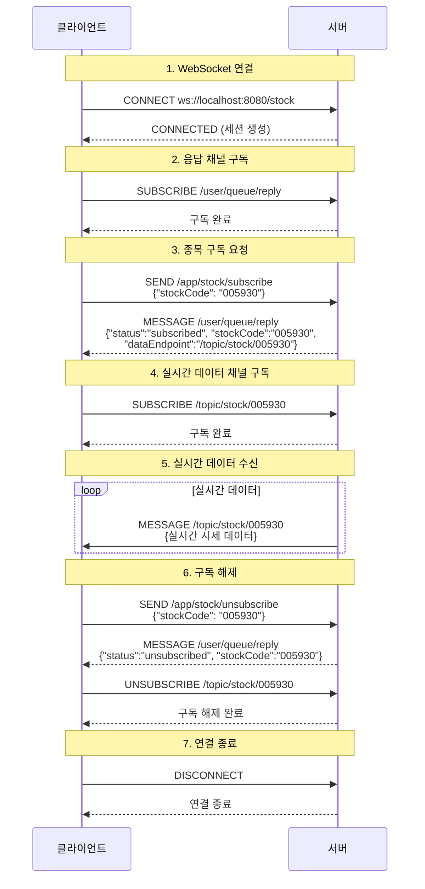
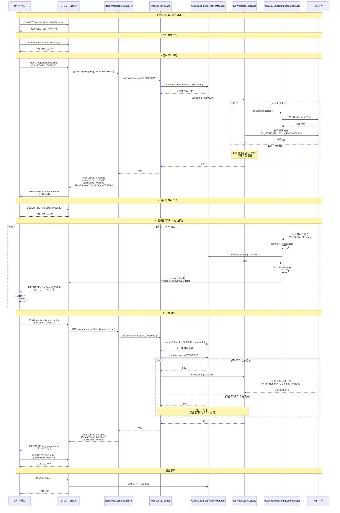

# STOMP-WEBSOCKET-TESTER

STOMP 프로토콜을 테스트 하는데 있어 Postman 으로 message 에서 null octet 을 처리하는게 불편하여 브라우저 상에서 간단하게 사용할 수 있는 테스터를 만듬.

---

### 클라이언트-서버 KOPI 실시간 시세 통신 흐름 (간소화)

---

## 클라이언트-서버 KOPI 실시간 시세 통신 전체 시스템 흐름 (상세)

